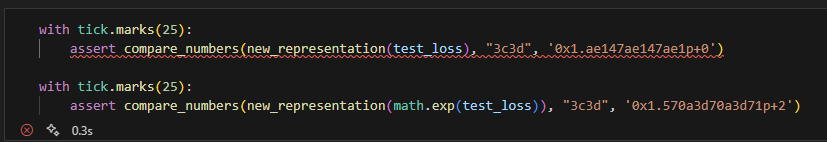
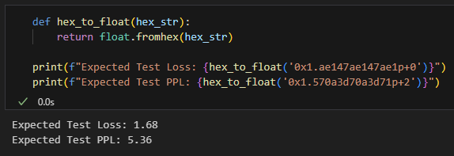
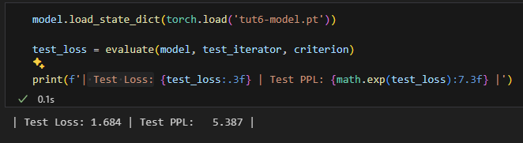
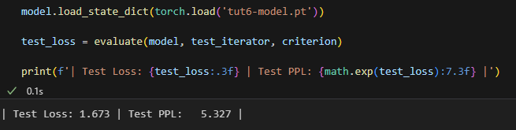
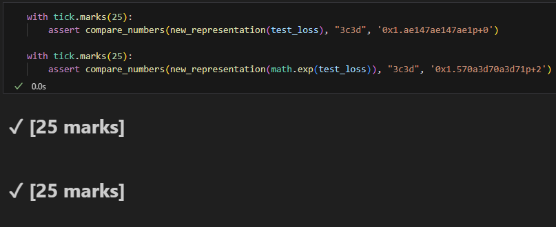
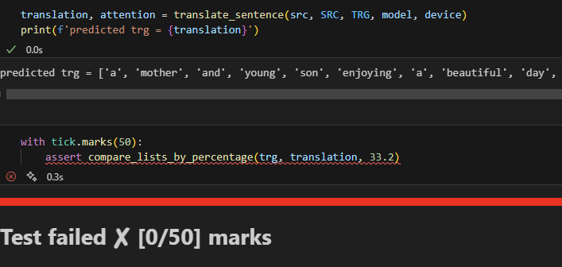

# Laboratorio 5 - Transformadores
**Universidad del Valle de Guatemala**\
**Facultad de Ingeniería**\
**Departamento de Ciencias de la Computación**\
**Deep Learning**

---

## Autores
- Diego Leiva
- Pablo Orellana

## Notas
Segun la documentacion de las funciones de comparacion y evaluacion
en esta seccion:\
\
Se espera que se obtengan los siguientes resultados:
\

Sin embargo luego de varias pruebas los resultados obtenidos son decimas de diferencia:
\

En el historial de Commits hay pruebas con CPU y GPU y en ambos casos despues de la epcoh 8 el modelo comienza a overfitearse por lo que mas de 10 epochs no resuelve el problema, un learning rate mas bajo provoca que se requieran mas epochs pero los resultados se estancan de manera similar alrededor del 1.68 y 3.37.
Sin embargo cambiando CLIP a 2 los resultados si son los esperados menores a 1.68 y 5.36, pero con estos resultados los siguientes test fallan.
\
\

Es muy probable que se deba al equipo utilizado, podria ser que la configuracion del computador este provocando esas variaciones en las milesimas esperadas.